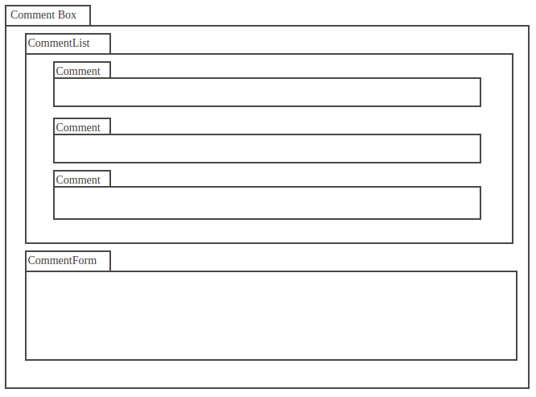
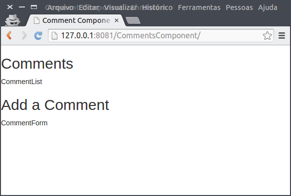
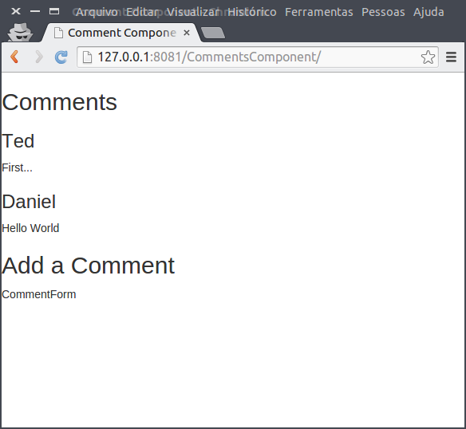
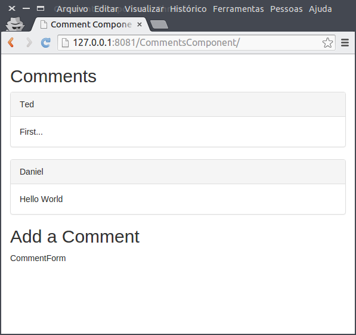
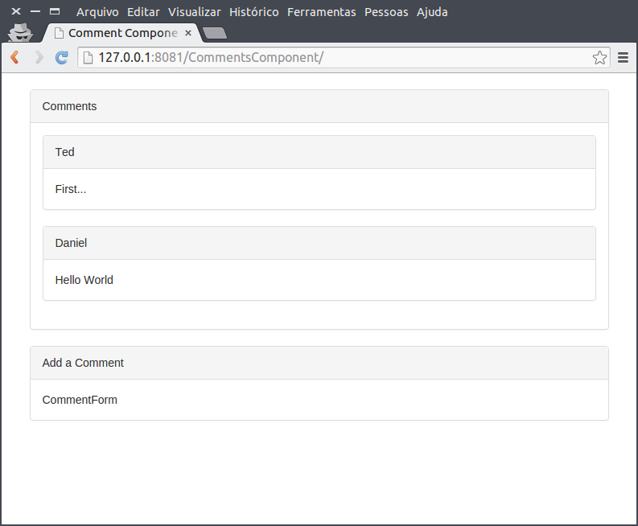
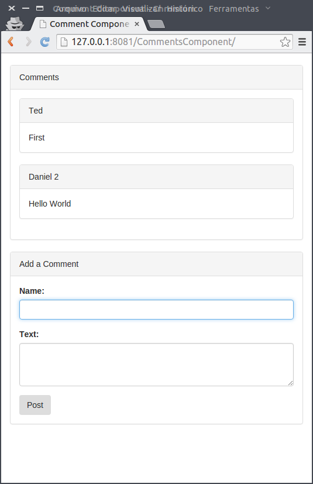

Este é o código fonte do livro [React - O Guia do Iniciante](https://leanpub.com/react-guia-do-iniciate). 

## Demos

- [CommentsComponent](http://danielschmitz.github.io/react-guia-do-iniciante-codigos/CommentsComponent/) - Capítulo 2


## Comments Component

Veja a evolução da criação do componente.Nesta obra criaremos no capítulo 2 um componente de comentários. A seguir mostramos algumas imagens do componente e sua evoulção estrutural:








## Comments Component 2

A pasta CommentsComponent2 é abordada no capítulo 3, possuindo a mesma funcionalidade do CommentsComponent, mas com as classes na forma modular. Utilizando várias técnicas com node, como o gulp, browserify, babelify, sourcemaps e outras, é realizado um processamento nos componentes e todos eles são compactados para um arquivo somente.

Para ter uma ideia exata da mudança, analise o arquivo CommentsComponent/main.js e CommentsComponent2/src/comment/CommentBox.jsx:

```jsx
import React from 'react';
import Panel from '../common/Panel';
import CommentForm from './CommentForm';
import CommentList from './CommentList';


var CommentBox = React.createClass({
   getInitialState: function() {
    return {data: this.props.data};
  },
  handleCommentSubmit: function(comment){
    var dataNew = this.state.data;
    dataNew.push(comment)
    this.setState({data:dataNew});
  },
  render: function() {
    return (
     <div className="commentBox">
        <Panel title="Comments">
             <CommentList data={this.state.data} />
        </Panel>
        <Panel title="Add a Comment">
            <CommentForm onCommentSubmit={this.handleCommentSubmit}/>
        </Panel>
      </div>
    );
  }
});
export default CommentBox;
```

## Comments Component 2 como instalar

Ao realizar o checkout deste repositório, o diretório "CommentsComponent2" não está pronto para ser acessado pelo servidor web. Como ele foi concebido para ser uma aplicação Javascript Modular, é necessário executar alguns comandos antes de testar o diretório no navegador.

Para executar estes comandos você precisa instalar Node e Npm (explicado no livro).

Após realizar o checkout, execute os seguintes comandos

```
cd CommentsComponent2
npm install
gulp
```

O comando `gulp` ficará "escutando" alterações nos arquivos fonte do projeto, e caso haja, irá "rebuildar" o mesmo. Abra um novo terminal e digite `http-server` para instanciar o servidor web e acesse o endereço repassado pelo servidor.

Caso encontre o erro que o `gulp` nao está disponível, execute o comando `npm install gulp -g`. Se necessário use o terminal em modo de administrador ou use `sudo`.


