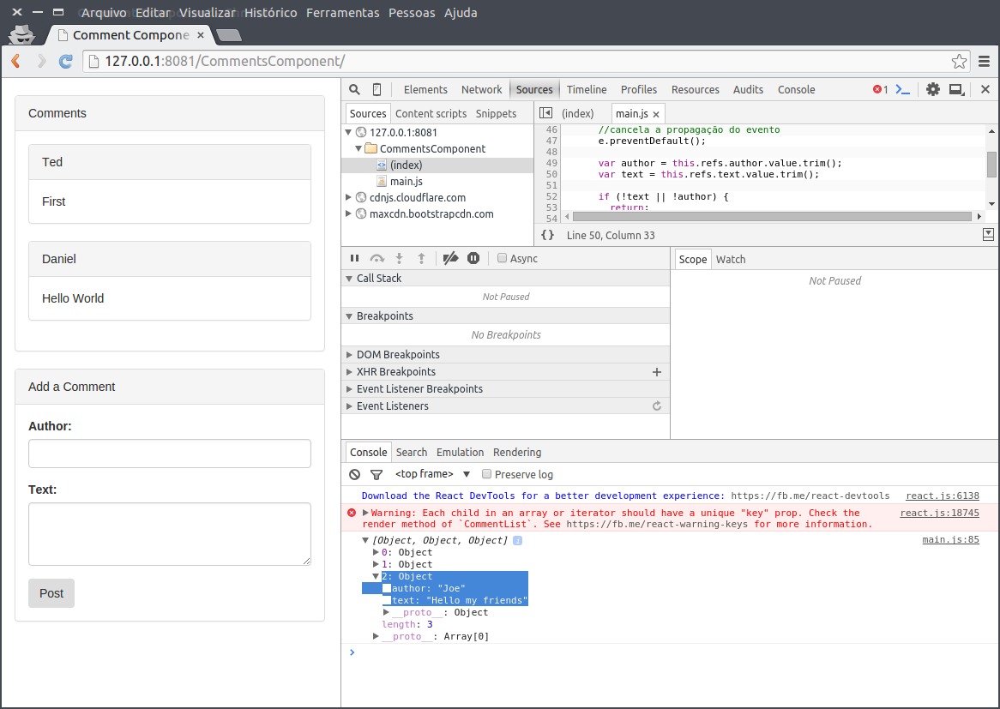

Este é o código fonte do livro [React - O Guia do Iniciante](https://leanpub.com/react-guia-do-iniciate). 

## Demos

- [CommentsComponent](http://danielschmitz.github.io/react-guia-do-iniciante-codigos/CommentsComponent/) - Capítulo 2

## CommentsController

Veja a evolução da criação do componente.Nesta obra criaremos no capítulo 2 um componente de comentários. A seguir mostramos algumas imagens do componente e sua evoulção estrutural:

